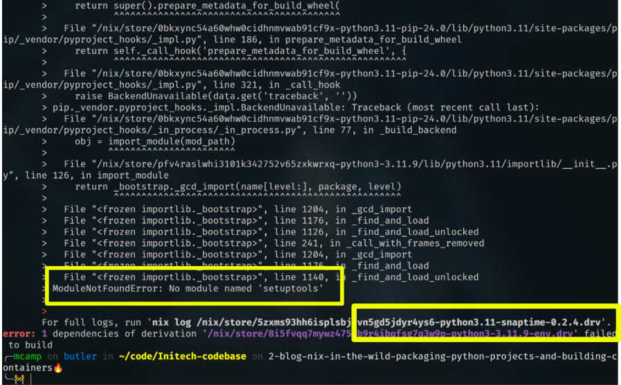
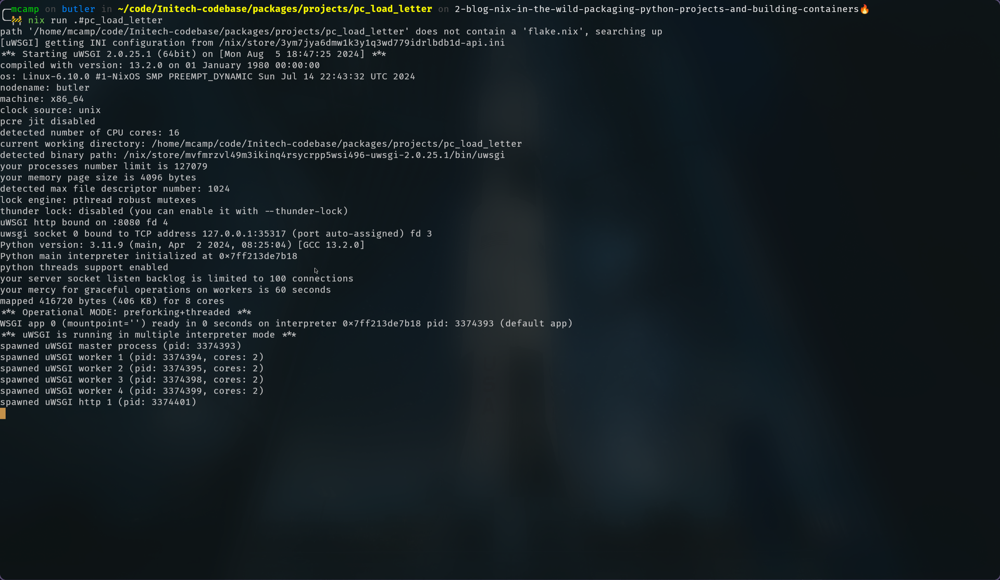
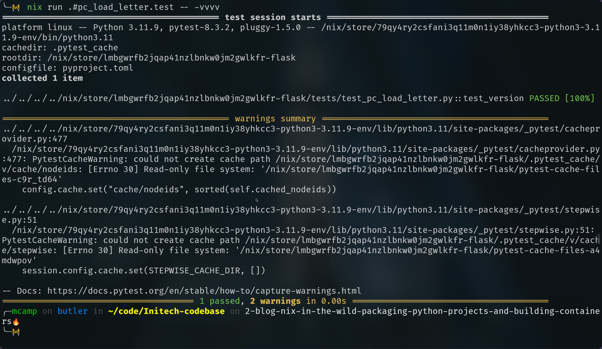
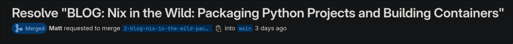

+++
author = "Matt Camp"
title = "Nix in the Wild: Packaging Python Projects and Building Containers"
date = "2024-08-07"
image = "nix-in-the-wild.png"
description = "In this post, we dive into the powerful combination of Nix and Python to streamline packaging and containerization. Learn how to package your Python projects with Nix for consistent builds and create Docker images for reliable deployments. Discover the steps to ensure reproducibility, eliminate 'works on my machine' issues, and enhance your DevOps practices. From setting up Nix packages with poetry2nix to building secure Docker containers, this guide provides everything you need to improve your development and deployment workflows."
slug = "nix-packaging-python-containers"
tags = [
    "Nix",
    "Python",
    "Docker",
    "Poetry",
    "DevOps",
    "Reproducible Builds",
    "Packaging",
    "Containerization",
    "CI/CD",
    "Software Development"
]
categories = [
    "Nix",
    "DevOps",
    "Software Engineering",
    "CI/CD"
]
series = ["Nix in the Wild"]
+++

# Packaging Python Projects and Building Containers with Nix

Welcome back! In our [last post](https://blog.aiexcalibur.com/p/nix-in-the-wild-nixing-your-codebase/), we
integrated Nix into our codebase by setting up `flake.nix` with the Snowfall library and configuring a simple
default devshell. While we could continue enhancing our devshells to include all necessary programs and
environment variables, this approach has its limitations. Devshells ensure that specified tools and settings
are installed, but they aren't fully isolated from the system's environment. This means developers can still
use programs or environment variables outside the shell's scope, which can undermine reproducibility by
introducing inconsistencies into the development workflow. In my opinion, devshells are excellent for setting
up an environment for interactive development or testing. However, they should not be solely relied upon as
the runtime environment for your software.

So, what should we do? You might be wondering, "Isn't the whole point of using Nix to make our software
reproducible?" The answer is yes, it is! However, to achieve true reproducibility, we need to go beyond
just specifying the tools we want available in our environment. We must use Nix to define precisely how
our software should be built and run, ensuring every aspect is controlled and predictable. In this post,
I'll demonstrate how we can take our existing Python projects, convert them into Nix packages, and create
Docker images. This approach not only allows us to run our tests without cloning repositories or managing
dependencies manually but also ensures that all we need is Nix installed and configured. By the end, you'll
see how Nix can fully encapsulate our software's runtime, providing a reproducible and reliable environment.

## Why Package Python Projects with Nix?

This is a real-world situation that happened just last week. We have a
Python project nested in a Git repository, similar to the ones in the [Initech
repo](https://gitlab.com/initech-project/main-codebase/-/tree/main/projects/complex_flink_job?ref_type=heads).
The Python project uses a virtual environment managed by [Poetry](https://python-poetry.org/), and
everything usually works fine. However, when a developer got a new computer and tried to install the
virtual environment with `poetry install`, they encountered issues with the `numpy` package. They tried
using both the system Python and the one specified in our devshell, but the problem persisted. After
some debugging, we discovered that Poetry was trying to install the environment with Python 3.12 (the
system Python) instead of 3.11, causing compatibility issues with some dependencies. Although we had
the correct Python version in the devshell, there was nothing explicitly instructing Poetry to use it,
leading to wasted time troubleshooting. At least two hours of work were spent resolving this problem, not to
mention the additional time spent debugging a broken Docker build caused by changes to the `pyproject.toml`
to make it work on the developer's machine. While it's easy to dismiss this as a typical business cost,
it doesn't have to be this way. We have tools that can practically eliminate this problem.

If we had been using Nix to manage the virtual environment, we wouldn't have encountered these
issues. We could have used [poetry2nix](https://github.com/nix-community/poetry2nix) to translate the
`poetry.lock` file into Nix expressions, ensuring that the exact dependencies and Python version were
consistently used. This would have prevented the compatibility issues we faced when Poetry tried to
install the environment with Python 3.12 instead of 3.11, and the changes to the `pyproject.toml`
needed to make it work on the developer's machine wouldn't have broken the Docker build. Moreover,
Nix's benefits extend beyond Python, as similar tools exist for other languages, allowing Nix to provide
consistent and reproducible builds across different technology stacks. By packaging projects with Nix,
developers can ensure that the entire environment, from dependencies to specific language versions,
is controlled and predictable. This not only saves time and effort but also significantly reduces the
risk of environment-related bugs and deployment issues.

## Setting Up Python Projects as Nix Packages

Packaging Python projects with Nix is straightforward, especially with Poetry. While the [NixOS
Wiki](https://nixos.wiki/wiki/Packaging/Python) provides detailed documentation on building Python packages
without Poetry, this discussion focuses on using Poetry for its simplicity and versatility. In this post,
we'll package the `pc-load-letter` [Flask](https://flask.palletsprojects.com/en/3.0.x/) app as an executable
Nix package. For other projects, like the `random-python-project` and [Flink](https://flink.apache.org/)
jobs, we'll cover in an upcoming post. By the end, you'll be
able to run the `pc-load-letter` Flask app in production mode with a single command, without needing to
install anything, while retaining access to the Python interpreter for interactive development.

### Adding `poetry2nix` to our Flake

To use `poetry2nix` in our project, we need to make a few additions to our `flake.nix` file. Specifically,
we'll add `poetry2nix` to the `inputs` section and include its overlay in the `overlays` list. Below
are the key changes you need to make:

In the `inputs` section, add:

```nix
poetry2nix.url = "github:nix-community/poetry2nix";
```

In the `overlays` list, add:

```nix
poetry2nix.overlays.default
```

These changes integrate `poetry2nix` into our Nix environment, enabling us to manage Python dependencies
defined in a `poetry.lock` file. Your `flake.nix` should include these additions alongside your existing
configurations.

### To Move the Projects or Not to Move Them: That Is the Question

The next step involves a decision: should you move your Python projects into the `packages` directory
or leave them in their original location? Currently, all Python projects are housed in a `/projects`
directory. You can keep them there, move the entire `/projects` directory into the `/packages` directory,
or choose any other organizational structure that suits your needs. For the demo project, I will be
moving the `projects` directory into `packages`.

If you decide to leave them in place, you'll still need to create a parallel file structure within
`/packages`, including at least a `default.nix` for each project. Personally, I believe that moving
everything to the `packages` directory is the best option, as it provides better organization. However,
the choice is entirely up to you; I just wanted to ensure you're aware of the different options available.

### Packaging

To create a minimal package within a Snowfall flake, start by creating a directory named after the
package, such as `packages/projects/pc_load_letter`. Inside this directory, create a `default.nix`
file. For a basic setup, this file can contain a simple derivation using the `mkDerivation` function. For
example, the `default.nix` file might include a derivation that specifies the package name and source
directory. This minimal example sets the foundation for creating a package, though it is unconfigured
and does nothing functional.

```nix
{
  pkgs,
  ...
}:
let
  pc-load-letter = pkgs.stdenv.mkDerivation {
    name = "pc-load-letter";
    src = ./.;
  };
in
pc-load-letter
```

#### Creating the Python Environment

Since this is a Python program, the first step is to set up a Python virtual environment. For a simple
project, you can do this with the following:

```nix
python-env = pkgs.poetry2nix.mkPoetryEnv {
  projectDir = ./flask/.;
  python = pkgs.python311;
};
```

_Note: `projectDir` should point to the directory containing the `pyproject.toml` file._

To make the Nix package use the Python environment defined by the `pyproject.toml`, you can replace the
`pc-load-letter` derivation with `python-env` in the `default.nix` file. This setup is similar to using
`poetry run python`, allowing you to run your Python environment. However, Nix can do more than just this;
it can make `nix run .#pc-load-letter` actually execute your entire application.

##### Handling an Edge Case

Creating a Python environment with the provided configuration is usually sufficient. However, there are
some ["edge cases"](https://github.com/nix-community/poetry2nix/blob/master/docs/edgecases.md) that
may require additional steps due to inconsistencies in the Python package ecosystem. For instance,
some packages, like `setuptools`, may need to be installed before other packages. The `poetry2nix`
[documentation](https://github.com/nix-community/poetry2nix?tab=readme-ov-file#how-to-guides) offers
guidance on handling these scenarios.



One example of such an edge case is with the `random-python-project`. You might not know there is an
issue until you try to build the Python environment and encounter an error. As shown in the image below,
look for the highlighted portion to identify the problem. In this case, the `snaptime` package required
`setuptools` to be pre-installed. To resolve this, we need to pass an override to `poetry2nix`. The
following configuration can handle multiple edge case packages if needed:

```nix
pypkgs-build-requirements = {
  snaptime = [ "setuptools" ];
};

p2n-overrides = pkgs.poetry2nix.defaultPoetryOverrides.extend (
  self: super:
  builtins.mapAttrs (
    package: build-requirements:
    let
      override = super.${package}.overridePythonAttrs (oldAttrs: {
        buildInputs =
          (oldAttrs.buildInputs or [ ]) ++ (builtins.map (req: super.${req}) build-requirements);
      });
    in
    override
  ) pypkgs-build-requirements
);

python-env = pkgs.poetry2nix.mkPoetryEnv {
  projectDir = ./.;
  python = pkgs.python311;
  overrides = p2n-overrides; #<-- Don't forget to add it here
  preferWheels = true;
};
```

This Nix code snippet sets up a Python environment with custom build requirements using `poetry2nix`. It
starts by defining a dictionary (`pypkgs-build-requirements`) that specifies additional packages needed
for building certain Python packages. For example, the `snaptime` package requires `setuptools` to be
pre-installed. Next, it creates `p2n-overrides`, which extends the default Poetry overrides provided
by `poetry2nix`. This extension involves iterating over the `pypkgs-build-requirements` dictionary and
modifying each package's `buildInputs` to include the necessary dependencies. The `overridePythonAttrs`
function is used to update the `buildInputs` attribute, ensuring that if `buildInputs` is not already
defined, it defaults to an empty list. The dependencies are then mapped to their corresponding Nix
packages using `builtins.map`, ensuring they are included during the build process. This setup ensures
that all specified build requirements are met when creating the Python environment.

#### How to Run the App

The fundamental point I want to emphasize is that we use Nix not just to define our dependencies but
also to specify how to run our software. While tools like Poetry list the necessary dependencies for our
Python applications, that's often not sufficient. It's crucial to define both what we need and how to use
it. With Nix, we can go a step further and explicitly detail how to run our code, ensuring consistency
and reproducibility in every environment.

For instance, the `pc-load-letter` application is a Flask app, and Flask apps typically require a WSGI
server like [uWSGI](https://www.youtube.com/watch?v=WqrCnVAkLIo) to run efficiently. We need to ensure
that our Nix package includes this setup or is compatible with it. In the existing `Dockerfile` for this
app, we've been using the following `CMD`:

```Dockerfile
CMD ["/root/.local/bin/uwsgi", "api.ini"]
```

With Docker, this command is specified separately in a `Dockerfile` alongside other setup instructions. While
Docker containers provide a consistent environment for packaging and running applications, the configuration
can be spread across various files and formats. If you've never had to install `uWSGI` in a container
compiled with the correct version of Python, you may not fully appreciate the challenges involved. This
process can be particularly difficult, especially if you're not familiar with WSGI configurations.

In contrast, Nix allows us to define everything—including dependencies, environment setup, and
run commands—in a single declarative language and file. This provides a more integrated approach,
where all aspects of the application's build and runtime environment are managed together. This unified
configuration ensures that our application runs consistently, no matter where it is deployed, without
relying on additional tools or scripts.

Since the `api.ini` file is supposed to have a path to our Python code, we will move this configuration
into the `default.nix` file. This allows us to use Nix's path interpolation to dynamically generate
the correct path to the Python code in the [Nix store](https://zero-to-nix.com/concepts/nix-store). The
configuration looks like this, using a Nix function to create text files in the Nix store:

```nix
app_ini = pkgs.writeText "api.ini" ''
  [uwsgi]
  wsgi-file = ${src}/pc_load_letter/app.py
  callable = app
  http = :8080
  processes = 4
  threads = 2
  master = true
  chmod-socket = 660
  vacuum = true
  plugins = python3
  die-on-term = true
'';
```

Once we have added the `app.ini` file to our Nix `default.nix` file, we can declare the WSGI app we want
to use. This is straightforward:

```nix
uwsgi = pkgs.uwsgi.override {
  python3 = python-env;
  plugins = [ "python3" ];
};
```

Notice that we specify the Python environment to use, which we defined earlier with `poetry2nix`. This
integration ensures that the correct Python environment is used, avoiding inconsistencies and making
the setup more robust.

Next, we'll create a script to run the application using a Nix function. Here's the code snippet:

```nix
run-with-wsgi = pkgs.writeShellApplication {
  name = "run-app";
  text = ''
    export PYTHONPATH="${python-env}/lib/python${builtins.substring 0 4
    python-env.python.version}/site-packages"
    ${uwsgi}/bin/uwsgi --ini ${app_ini}
  '';
};
```

In this script, we use the `${}` syntax for string interpolation, which allows Nix to automatically insert
the correct paths from the Nix store. The Nix store is just the location at `/nix/store` where Nix stores
all packages and dependencies. Specifically, `${python-env}` and `${uwsgi}` are placeholders
that get replaced with the exact paths to the Python environment and the `uwsgi` binary, respectively,
within the Nix store. Additionally, we set the `PYTHONPATH` environment variable to ensure that `uwsgi`
can access our specified Python environment, including all necessary libraries.

This use of string interpolation ensures that all file paths are precise and consistent with the specific
versions and configurations in the Nix store, providing a reliable and reproducible setup for running
the application.

So at this point we can have our `default.nix` return `run-wish-wsgi` and we could be done and that would
look like this:

```nix
{ pkgs, ... }:
let

  src = ./flask/.;

  python-env = pkgs.poetry2nix.mkPoetryEnv {
    projectDir = src;
    python = pkgs.python311;
  };

  uwsgi = pkgs.uwsgi.override {
    python3 = python-env;
    plugins = [ "python3" ];
  };

  run-with-wsgi = pkgs.writeShellApplication {
    name = "run-app";
    text = ''
      export PYTHONPATH="${python-env}/lib/python${builtins.substring 0 4
      python-env.python.version}/site-packages"
      ${uwsgi}/bin/uwsgi --ini ${app_ini}
    '';
  };

  app_ini = pkgs.writeText "api.ini" ''
    [uwsgi]
    wsgi-file = ${src}/pc_load_letter/app.py
    callable = app
    http = :8080
    processes = 4
    threads = 2
    master = true
    chmod-socket = 660
    vacuum = true
    plugins = python3
    die-on-term = true
  '';
in
run-with-wsgi
```

You would then be able to do the following command and have the Flask app running on port `8080`.

```bash
nix run .#pc-load-letter
```



### Providing a Python Interpreter via `passthru`

Running an application with a single command without additional installations is ideal. However, there are
times when access to a Python REPL or the underlying Python interpreter is necessary for other tasks. To
enable this, we can add a `passthru` attribute to our `default.nix` using `pkgs.stdenv.mkDerivation`.

The `mkDerivation` function sets up a folder structure in the Nix store. We need to specify the `src`
attribute, which points to the current directory, and use the `installPhase` to organize our application and
its source code. While the structure can be flexible, it is advisable to follow a standard layout—for
example, using `bin` for binaries/executable files and `src` for source files. The `mkDerivation`
function provides special variables like `$src` and `$out`. `$out` represents the root of the derivation
in the Nix store, and `$src` refers to the source path defined by `src = ./.`. To make our source code
accessible when building this package, we place it in the `$out/src` directory. The executable for the
`run-with-wsgi` application should be placed in the `$out/bin` directory.

The `passthru` attribute is used to expose additional information or dependencies that are not directly
involved in building the package but are useful for other purposes. Here's an example of how to include
a Python environment:

```nix
pc-load-letter = pkgs.stdenv.mkDerivation {
  name = "pc-load-letter";
  src = ./.;
  phases = [ "installPhase" ];
  installPhase = ''
    mkdir -p $out/src
    mkdir -p $out/bin
    cp -r $src/flask/* $out/src
    cp ${run-with-wsgi}/bin/run-app $out/bin/run-app-with-wsgi
  '';
  passthru = {
    python = python-env;
  };
  meta = {
    mainProgram = "run-app-with-wsgi";
  };
};
```

In this example, `python-env` represents the Python environment we want to expose. By including `python =
python-env;` under the `passthru` attribute, we make this environment available.

It is important to note that `meta.mainProgram` is necessary if the main executable's name differs
from the value specified in the `name` attribute. With this configuration, users can access the Python
interpreter for development, debugging, or running additional scripts. This setup enhances the package's
versatility by providing not only the main application but also the necessary tools for various tasks.

### Simplifying Testing

With our package now in a stable, production-ready state, and equipped with various tools for development
and alternative use cases, let's focus on testing. As professional software developers, we understand
the importance of writing and executing tests. However, specifying the correct way to run tests in Merge
Requests can often lead to confusion, whether it's about the right directory to execute PyTest from or
ensuring the `PYTHONPATH` is correctly set. These issues can cause inconsistencies and frustrations.

Testing should be straightforward, accessible to the entire team, and seamlessly integrated into our CI/CD
pipelines. While I can't improve the quality of your tests, I can help streamline the process of running
them, making it as effortless as possible. Let's remove any barriers and simplify testing for everyone.

To start, we can define how to run our tests using Nix. We can add a script to our `default.nix`
file that outlines the steps needed to execute our tests. Since we're using PyTest, we just need to
set the `PYTHONPATH` and specify the directory containing our tests. Here's an example script for our
`pc_load_letter` project:

```nix
run-tests = pkgs.writeShellScriptBin "run-tests" ''
    export PYTHONPATH="${python-env}/lib/python${
      builtins.substring 0 4 python-env.python.version
    }/site-packages:${src}"
    ${python-env}/bin/pytest ${src}/tests/ "$@"
'';
```

_Note: The `"$@"` at the end allows for additional arguments to be passed._

Next, we add this script as a `passthru` in the `mkDerivation` function, similar to how we did with
`python-env`. Now, to run the tests, you can simply use the command:

```bash
nix run .#pc_load_letter.test

# or for more verbose testing

nix run .#pc_load_letter.test -- -vvv
```



This is really simple—let's do this for all of our projects! If we want to automate our testing in CI,
writing `nix run .#<package name>.test` for every project can become tedious, especially as new projects
are added. Fortunately, we can simplify this process further by using Nix Flakes' `checks` feature,
which allows us to define tests for each package and validate code across different environments and setups.

For example, we can create a folder `checks/pc_load_letter` at the root of the project with a `default.nix`
file that specifies the testing procedure. While you probably could have include the PyTest script here,
but I decided to just leave it in the package, which makes this check pretty simple:

```nix
{ pkgs, ... }:

pkgs.runCommand "pc_load_letter" { src = ./.; } ''
  mkdir -p $out
  ${pkgs.initech.pc_load_letter.test}/bin/run-tests > $out/results.txt
''
```

By following this pattern for every package in the flake, you can run:

```bash
nix flake check
```

to execute all tests with a single command, making the process much simpler. We will cover more of
the intricacies of `hooks` in future posts.

## Building Docker Images

It's great that we can run a Flask app with a single command, but let's be honest—these days,
everything's about Kubernetes. That means we need a Docker container, and some might think this whole
Nix thing is just a novelty. Well, that's nonsense because [Nix builds Docker images better than Docker
itself!](https://youtu.be/gXHG3-CZ7CU)

I've been using Docker since 2016 and have spent countless hours trying to containerize everything
imaginable. Working in air-gapped environments often meant that if I needed a tool, I had to either
containerize it or go without. I've containerized [everything](https://github.com/usmcamp0811/campfiles/blob/master/Dockerfile),
from terminal emulators to web browsers,
to use them on air-gapped computers. However, it wasn't until I started using Nix last summer that I
realized I had it all wrong. My life would have been a million times easier if I had just been using
Nix from the start.

Typically, with Docker, we'd find an appropriate base image, like Ubuntu or a Python image. If
you're in an organization, you probably want to control which base images are used to ensure
security best practices are followed. This is what I aimed to simulate with the [Initech base Python
image](https://gitlab.com/initech-project/main-codebase/-/blob/c90859a0f1bdb3f4b50ce47504ae05ddbf91ab31/docker/python-base/Dockerfile).
Once you have a base image for your organization, the teams need to use it and add their tools'
dependencies. This could be straightforward, like running `apt install` for a few packages, or it could get
complicated when you need something that's not in the Ubuntu or Red Hat repos (which happens often). Then,
you face a long development cycle to build out the image.

Here's an example of what can happen: you have a Docker image with a Python app or maybe Jupyter, and you
need to update the version of `openssl` due to security concerns. This requires updating the base image,
which means updating to a newer version of Ubuntu, changing `apt` repos, and possibly dealing with a
different Python version. Suddenly, you're stuck updating all your Python dependencies because you've
uncovered a tangled mess. Next thing you know, you're two or three sprints in and still struggling to
get the image working as expected. Let's be real—you know this has happened to you. So enough talking
about how great Nix is at containers—let's just do it already.

Add this to the `default.nix`:

```nix
container = pkgs.dockerTools.buildLayeredImage {
    name = "pc-load-letter";
    tag = "latest";
    contents = [ run-with-wsgi ];
    config = {
      Entrypoint = [ "run-app" ];
    };
};
```

Then add it to the `passthru` of your `mkDerivation` and you're done.

You can build your image by simply doing:

```bash
nix build .#pc-load-letter.container && docker load -i ./result
```

You can run the image and confirm I'm not blowing smoke by doing:

```bash
docker run -it --rm -p 8080:8080 pc-load-letter:latest
```

You'll find the Flask app in your browser at [http://localhost:8080](http://localhost:8080).

As you can see, this approach is far more concise than writing a `Dockerfile`! Plus, you get some added
benefits that your security department will appreciate. The resulting Docker image contains only the
exact components your application requires—nothing more, nothing less. There's not even a shell,
significantly reducing your attack surface compared to an imperatively configured `Dockerfile` that
might include extra packages for tasks like extracting or building files.
Another nice feature of Nix-built Docker images is that they maximize the reuse of image layers between
different images. This optimization reduces the disk space required by your container registries, making
them more efficient.

## Wrapping Up

We've explored a comprehensive workflow for packaging Python projects with Nix, creating Docker images,
and ensuring reproducibility across environments. By leveraging Nix, we can achieve a fully declarative
setup that eliminates "it works on my machine" issues and streamlines the deployment process.

**Key Takeaways:**

1. **Environment Consistency**: Nix allows us to define precise environments, ensuring all dependencies,
   including specific versions of Python and packages, are consistently used across systems. This prevents
   common issues caused by system discrepancies.

2. **Integrated Tooling**: Tools like `poetry2nix` simplify the translation of a `poetry.lock` file
   into Nix expressions, seamlessly managing Python dependencies. This also enables the integration of
   application-specific configurations directly into the Nix setup, avoiding pitfalls associated with
   manually managed configurations.

3. **Simplified Deployment**: By defining how to run software in Nix, we can package dependencies and
   ensure the application runs as expected, making it particularly beneficial for complex environments.

4. **Efficient Testing and CI Integration**: Nix's `checks` feature streamlines the testing process,
   making it easy to run tests consistently and integrate them into CI/CD pipelines.

5. **Containerization with Nix**: Building Docker images using Nix offers a secure and efficient alternative
   to traditional Dockerfiles. Nix-built images include only the necessary components, reducing the attack
   surface and optimizing storage through layer reuse.

Adopting Nix for packaging and containerization provides a robust, reproducible, and maintainable setup that
enhances development workflows and deployment practices. Whether you're working with Python, other languages,
or mixed technology stacks, Nix offers a versatile solution for managing your software's lifecycle.

This post focused on the `pc_load_letter` project, but the steps outlined are applicable to other
Python projects and similar for other languages. You might be thinking, "The `default.nix` file is 75
lines—much longer than my typical `Dockerfile`." In the next post, we'll explore how to streamline the
`default.nix` file and standardize configurations using Nix library functions.

Thank you for joining me on this journey through Nix in the
wild. [Subscribe](https://blog.aiexcalibur.com/index.xml) for more insights as we delve into hooks,
advanced packaging techniques, and more. Happy hacking!

[](https://gitlab.com/initech-project/main-codebase/-/merge_requests/2)
