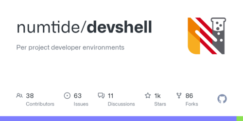
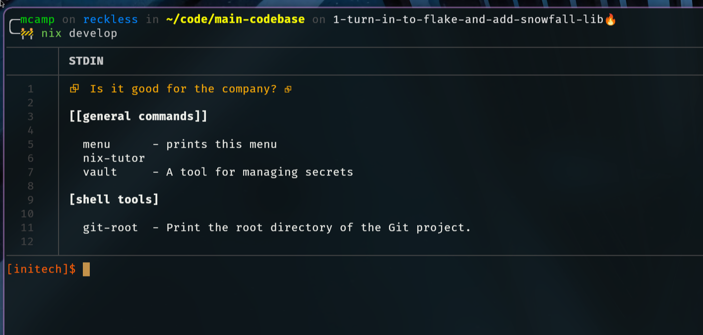
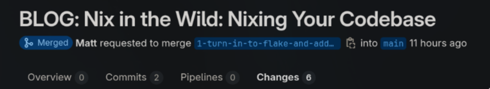

+++
author = "Matt Camp"
title = "Nix in the Wild: Nixing Your Codebase"
date = "2024-08-03"
image = "nix-in-the-wild.png"
description = "This post dives into integrating Nix into your existing codebase, setting up a Nix shell, and leveraging the Snowfall library for streamlined project management. Explore practical steps to create reproducible and consistent development environments, making your workflows more efficient and reliable."
tags = [
  "Nix",
  "Flakes",
  "Development Environment",
  "CI/CD",
  "Infrastructure as Code",
  "Home Manager"
]
categories = [
  "Nix",
  "DevOps",
  "Software Development",
  "Programming"
]
series = ["Nix in the Wild"]
+++

# Nix in the Wild: Nixing Your Codebase

Welcome back to the 'Nix in the Wild' series. In this post, we'll dive into the practical steps of
integrating Nix into your existing codebase. We'll establish the foundational elements, including
creating a `flake.nix` file and setting up the directory structure necessary for the [Snowfall
library](https://snowfall.org/guides/lib/quickstart/). Additionally, we'll create our first Nix shell
to help teams standardize their development environments. I'll also share some lessons learned from my
experience with Nix, discussing why I chose Snowfall, what I appreciate about it, and what I'd like to
see improved. Let's dive in and start 'nixing' our codebase.

## Setting Up Nix with Flakes

To follow along, ensure you have Nix installed from the previous [post](https://blog.aiexcalibur.com/p/nix-in-the-wild-exploring-the-power-of-nix-for-organizational-codebases/). If you haven't already, you need
to enable Flakes by adding the following line to your Nix configuration file:

```
experimental-features = nix-command flakes
```

This can be done in `~/.config/nix/nix.conf` or `/etc/nix/nix.conf`.

### What Are Flakes?

Flakes are a relatively new feature in Nix, currently classified as experimental. Despite this, they're
expected to become a standard part of Nix due to how useful they are. Flakes simplify version management
for Nix packages and make it easier to utilize external resources. For a more detailed explanation,
check out [Jake Hamilton's YouTube video](https://www.youtube.com/watch?v=cw4wJjjQYMU).



In this series, I'm using the [Initech demo repo](https://gitlab.com/initech-project/main-codebase), a
monorepo designed to simulate a full organizational codebase. When working with Flakes, it's important
to note that there's a one-to-one mapping between a Flake and a Git repository. Nix can only recognize
files in a Flake if they are tracked by Git. So, if you encounter errors, check if the relevant files
are added to Git. Remember, you don't need to commit changes immediately—just ensure the files are tracked.

### Why Use a Monorepo?

For the Initech demo, I've chosen a monorepo setup for its convenience and numerous benefits in managing
multiple small projects. Monorepos are particularly advantageous when dealing with platforms or a large
number of systems, as they streamline code reuse and eliminate the need for frequent updates to lock
files. The choice between a monorepo and a polyrepo depends on specific project needs and personal
preference. However, I've found that monorepos greatly simplify management, especially in scenarios
involving multiple systems and smaller projects.

If a monorepo doesn't suit your organization but you have several interconnected components, consider
creating a Flake that acts as an aggregator for all your organization's Flakes. This approach allows
you to precisely version the interaction of sub-projects and facilitates integration checks in your CI
pipeline with minimal commands.

### Setting Up `flake.nix`

Now, let's start setting up our codebase with Nix. In the root of the [Initech
repo](https://gitlab.com/initech-project/main-codebase), we'll create a `flake.nix` file using the
following command. The `flake.lock` file will be autogenerated later.

```bash
nix flake init
```

#### Why Use Snowfall Lib?

While it's not mandatory to use Snowfall Lib for structuring your Flakes, I've found it to be incredibly
helpful. Snowfall is an opinionated library designed for Nix Flakes, which can be particularly advantageous
when you're starting out. By providing a recommended folder structure, it minimizes the complexity of
setting up your project and reduces the number of decisions you need to make. Snowfall handles the "glue
code" required for importing modules into your Flake and overall just makes it easier to manage your
setup. I've successfully used Snowfall to manage a range of systems in my homelab and various work projects.

Here’s an example of a basic `flake.nix` with no configuration that you get from the above command:

```nix
{
  description = "A very basic flake";

  inputs = {
    nixpkgs.url = "github:nixos/nixpkgs?ref=nixos-unstable";
  };

  outputs = { self, nixpkgs }: {
    packages.x86_64-linux.hello = nixpkgs.legacyPackages.x86_64-linux.hello;
    packages.x86_64-linux.default = self.packages.x86_64-linux.hello;
  };
}
```

#### Configuring Inputs

Next, we'll add the [Snowfall Lib](https://github.com/snowfallorg/lib) repository to the `inputs`
section. Additionally, it's a good idea to specify the current stable branch of `nixpkgs` and an unstable
branch for flexibility in choosing packages. You can manage this selection using overlays, which we will
cover later. Here's an example of what your `inputs` might look like:

```nix
inputs = {
  nixpkgs.url = "github:nixos/nixpkgs/nixos-24.05";
  unstable.url = "github:nixos/nixpkgs?ref=nixos-unstable";

  snowfall-lib = {
    url = "github:snowfallorg/lib";
    inputs.nixpkgs.follows = "nixpkgs";
  };
};
```

### Defining Outputs

Earlier in this post, we introduced a basic example of defining outputs in a Nix Flake:

```nix
outputs = { self, nixpkgs }: {
  packages.x86_64-linux.hello = nixpkgs.legacyPackages.x86_64-linux.hello;
  packages.x86_64-linux.default = self.packages.x86_64-linux.hello;
};
```

In this example, the `outputs` attribute is defined as a function that takes two arguments: `self` and
`nixpkgs`. The function then returns a set of packages, specifically two Linux packages: `hello` and
`default`. This simple function demonstrates how outputs can be constructed based on the inputs provided
to the function.

Now, we'll transition from this basic setup to a more sophisticated one using the `mkFlake` function
from the Snowfall Lib. This library provides a standardized way to define outputs, making it easier
to manage complex configurations. Instead of manually specifying the outputs, we leverage `mkFlake`
to automate and streamline the process.

Here’s how we use Snowfall Lib to define our outputs:

```nix
outputs = inputs:
  inputs.snowfall-lib.mkFlake {
    inherit inputs;
    src = ./.;

    # Configure Snowfall Lib. All settings are optional.
    snowfall = {
      # Specify the directory for your Nix files.
      root = ./.;

      # Define a namespace for your flake's packages, libraries, and overlays.
      namespace = "initech";

      # Add metadata that can be utilized by tools like Snowfall Frost.
      meta = {
        # A slug for documentation, typically used in file paths.
        name = "initech";

        # The title for your flake, often the project's name.
        title = "Initech Demo Codebase";
      };
    };
  };
```

In this setup, the `outputs` function uses the `inputs` to call `mkFlake`, a utility function provided by
Snowfall Lib. The `mkFlake` function simplifies configuration by managing common tasks and structures,
allowing you to focus on higher-level configurations. It generates outputs based on the provided
`inputs`, such as Nix packages and any additional input Flakes. Because `mkFlake` is opinionated about
the folder structure, it can automatically stitch everything together. This results in outputs that
export all packages, define multiple computer systems, and set up user profiles—all without the need
for custom plumbing. This approach not only reduces boilerplate but also ensures consistency across
different projects. By adopting Snowfall Lib, you can streamline your development process, particularly
in environments with multiple systems and components.

## Organizing the Project with Snowfall

In this section, I'll give a quick rundown of the various directories. I've noticed that when
introducing Nix to an existing codebase, people often wonder why these new directories suddenly appear
and what they're for, especially if they're only vaguely familiar with the reasons for adopting Nix
in the first place. Understanding the role of each directory will help make the structure and purpose
of the setup clearer. For more details, the Snowfall documentation is excellent and can be found
[here](https://snowfall.org/guides/lib/quickstart/).

### Snowfall Directory Structure

This structure for me has generally gone at the root of the git project but it is possible to
move it elsewhere in the project. The Snowfall docs have ./nix as being their example location.
Below is a high level overveiw of what the structure of our projects will look like once we
add Snowfall and Nix.

#### Root Directory

- **flake.nix**: Your Nix Flake definition.
- **flake.lock**: The lock file that tells Nix what versions of `nixpkgs` and other Flakes to use.

#### Library Functions

- **lib/** (optional): This directory is designated for custom library functions. It can contain helper
  functions to standardize common tasks or reduce boilerplate code. With Nix being a programming language,
  the possibilities are extensive.

  - `default.nix`: If you choose to add additional library functions, they would go here. This file
    defines an attribute set that merges with the existing lib.

#### Package Definitions

- **packages/** (optional): This directory is where we define the packages that our Flake can export. These
  packages don't have to be large or complex; they can be as simple as a script that performs a specific
  task and needs to be easily accessible to others. Alternatively, you can use this space to repackage
  existing software that isn't already available in the Nix ecosystem. We'll cover more on this topic
  in later blog posts.

  - `<package-name>/default.nix`: This file contains a function that returns a derivation for the package.

  To run the packages defined here, you can use the following command:

  ```bash
  nix run <local or remote path to flake>#<package-name>
  ```

#### NixOS and Home Manager Modules

- **modules/** (optional): This directory is used for managing one or more computer systems with
  NixOS or configuring user environments, such as dotfiles. It provides a central location for your
  [Nix modules](https://nixos.org/manual/nixos/stable/#sec-writing-modules). When I mention dotfiles, you
  might think of configuration files for various software, and you're not far off. However, with Snowfall,
  we can create reusable modules that can be imported into other configurations. For example, you could
  define how an Apache Kafka server should be configured when deployed to a system or specify which
  plugins should
  automatically be available in Firefox when setting up a home environment. We'll dive deeper into this
  with later Posts.
  - `<platform>/<module-name>/default.nix`: Platform-specific modules, such as for `nixos` or `darwin`.

#### Overlays

- **overlays/** (optional): Overlays are a powerful feature in Nix that allow you to customize or
  extend the `pkgs` namespace from your chosen `nixpkgs` version. For instance, you can use an overlay
  to select the latest version of Firefox from the unstable branch or to replace the default Neovim with
  your customized version whenever Neovim is added. Think of overlays as a way to "overlay" additional
  packages or configurations onto the existing package set. You can use them to override existing packages
  or introduce new ones.

  - `<overlay-name>/default.nix`: This file contains a function to modify the set of packages (`pkgs`).

  For example, here's what `nix-tutor/default.nix` might look like, providing `pkgs.nix_tutor` as an
  installable package elsewhere in the Flake:

  ```nix
  { channels, nix-tutor, nixpkgs, ... }:

  final: prev: {
    nix_tutor = nix-tutor.packages.${prev.system}.menu;
  }
  ```

#### System Configurations

- **systems/** (optional): This directory is for configurations of your NixOS systems, virtual machines,
  or AMIs for cloud platforms like Azure or AWS. The system configurations here generally don't contain
  extensive logic; instead, they primarily enable modules defined in the `modules/` directory. This setup
  allows for highly standardized systems or VMs that can be reconfigured and updated dynamically, ensuring
  consistency across deployments.

  For instance, in my personal [dotfiles repo](https://gitlab.com/usmcamp0811/dotfiles.git), I've set
  up GitLab CI/CD to automatically build all my systems upon commit and deploy them upon merge. This
  approach transforms system management, as any system can build another and then deploy the resulting
  configuration, opening up numerous possibilities!

- `<architecture>-<format>/<system-name>/default.nix`: Configuration files for specific systems (e.g.,
  `x86_64-linux`, `aarch64-darwin`).

  Here's an example configuration, where `initech` includes modules defined in the `modules` directory:

  ```nix
  {
    pkgs,
    config,
    lib,
    ...
  }:
  with lib;
  in {
    imports = [ ./hardware.nix ];

    initech = {
      archetypes.developer = enabled;

      system = {
        boot = enabled;
        passwds = enabled;
      };

      user = {
        name = "gumby";
        fullName = "Matt Camp";
        email = "matt@aiexcalibur.com";
        extraGroups = [ "wheel" ];
      };

      services = {
        openssh = {
          enable = true;
          authorizedKeys = [
            "ssh-ed25519 AAAAC3NzaC1lZDI1NTE5AAAAIGw+o+9F4kz+dYyI2I4WudgKjyFOK+L0QW4LhxkG4sMt
            gitlab-runner@aiexcalibur.com"
            "ssh-ed25519 AAAAC3NzaC1lZDI1NTE5AAAAIKdMWMFyi7Lvjm78KOX3tKZ5bkEZ7bHA56ZKKtTb9wIo
            mcamp@aiexcalibur.com"
          ];
        };
        ntp = enabled;
      };
    };

    system.stateVersion = "23.05";
  }
  ```

  In this configuration, various modules and services are specified, such as SSH keys and NTP services,
  ensuring a consistent setup across the system.

#### User Home Configurations

- **homes/** (optional): This directory is used for home environment configurations, which are similar to
  system configurations but tailored for individual users rather than entire systems. These configurations
  can be applied across various operating systems, not just NixOS. For example, you might want to provide
  standardized yet customizable user environments for everyone in your organization. Each user could have
  a configuration in this directory, allowing them to enable specific modules with customized options.

- `<architecture>-<format>/<home-name>/default.nix`: Configuration file for individual user home
  environments.

Here's an example user configuration file:

```nix
{
  lib,
  pkgs,
  config,
  ...
}:
{
  initech = {
    user = {
      enable = true;
      name = "gumby";
      fullName = "Matt Camp";
      email = "matt@aiexcalibur.com";
    };

    cli = {
      zsh = enabled;
      bash = enabled;
      env = enabled;
      home-manager = enabled;
      k9s = enabled;
      broot = enabled;
      ranger = enabled;
      neovim = enabled;
    };

    services = {
      openssh = enabled;
      syncthing = enabled;
    };

    tools = {
      git = enabled;
      direnv = enabled;
      vault = enabled;
    };
  };

  home.stateVersion = "23.05";
}
```

A user could activate this configuration with the following command:

```bash
nix run <path to flake>#homeConfigurations.<user-name>@<system-name>.activationPackage
```

This setup allows for defining a variety of user-specific settings and applications, which can be easily
deployed and managed across different systems.

#### Development Shells

- **shells/** (optional): This directory is where you can define various Nix shells. Think of these
  shells as being similar to Docker containers but with less isolation. When you activate a Nix shell, it
  makes all the specified programs and environment variables available, allowing users to easily set up a
  consistent environment across different systems. This is particularly useful for organizations adopting
  Nix, as it simplifies the onboarding process by providing a pre-configured development environment. No
  more spending days or weeks setting up; a well-defined shell can get new team members up and running
  quickly.

  However, be cautious about the temptation to include everything your team uses in a single shell. While
  possible, this can lead to long initial load times and a less efficient setup. A better strategy is
  to create
  shells tailored to specific tasks—one for building projects, another for testing, etc. This way,
  you load only what you need, when you need it, but you still have the option to include everything if
  that's what you prefer.

  - `<shell-name>/default.nix`: This file contains a function that defines the Nix shell.

  Here's an example of a simple shell:

  ```nix
  { mkShell, pkgs, ... }:
  mkShell {
    buildInputs = with pkgs; [
      neovim
      k3d
      podman
      kubernetes
      k9s
    ];

    shellHook = ''
      echo -e "\e[32m+-----------------------------------------------------------+\e[0m"
      echo -e "\e[32m|⮺  Initech: Is it good for the company?                    |\e[0m"
      echo -e "\e[32m+-----------------------------------------------------------+\e[0m"

      # Additional setup can go here
    '';
  }
  ```

To activate the shell defined here, you can use the following command:

```bash
nix develop <local or remote path to flake>#<shell-name>
```

This setup ensures a reproducible and efficient development environment tailored to your team's needs.

#### Templates

- **templates/** (optional): This directory is used for storing directories of templated files that you
  want to reuse. These templates are basic and don't support automatic modification but can be a helpful
  starting point for writing new modules or Flakes.

  - `<template-name>/`: Files and folders placed here will be created wherever the template is deployed.

To deploy a template, use the following command in the directory where you want the templated files to
be generated:

```bash
nix flake init --template <local or remote path to flake>#<template-name>
```

This command will create the template's files and folders at the specified location, making it easy to
set up new projects with a predefined structure.

## Creating a Default Shell Environment

Earlier, I provided a snippet of a basic Nix development shell, which is perfectly sufficient
for many needs. However, I've had great success using a specialized development shell by
[Numtide](https://numtide.github.io/devshell/getting_started.html). This shell uses TOML files to define
the entire environment, which is especially appealing to those who are still hesitant about adopting
Nix. The TOML configuration is straightforward, and you can easily extend it with pure Nix code for more
advanced functionality. In this section, I'll show you how to set up a simple default Nix development
shell using the Numtide dev shell.

### Update the `flake.nix`

#### Add the Numtide Devshell Flake to the `inputs`

[](https://numtide.github.io/devshell/getting_started.html)

```nix
inputs = {
  nixpkgs.url = "github:nixos/nixpkgs/nixos-24.05";
  unstable.url = "github:nixos/nixpkgs?ref=nixos-unstable";

  snowfall-lib = {
    url = "github:snowfallorg/lib";
    inputs.nixpkgs.follows = "nixpkgs";
  };

  devshell.url = "github:numtide/devshell"; # <-- We added this right here
};
```

#### Add the Numtide Devshell to the `mkFlake` Function's `overlays` Argument

Using the `overlays` argument in `mkFlake` is a bit different from adding overlays to the
`/overlays` directory. This approach is good for quickly adding predefined functionality, like
`devshell.overlays.default`, which brings in default features from the `devshell` Flake with minimal
fuss. On the other hand, using the `/overlays` directory is more about allowing you to tweak how packages
from `nixpkgs` are modified or added.

```nix
outputs = inputs:
  inputs.snowfall-lib.mkFlake {
    inherit inputs;
    src = ./.;
    snowfall = {
      root = ./.;
      namespace = "initech";
      meta = {
        name = "initech";
        title = "Initech Demo Codebase";
      };
    };
    overlays = with inputs; [
      devshell.overlays.default
    ];
  };
```

### Make a Devshell

Now that you've added the overlay, the next step is to create the devshell. In the `/shells` folder,
create a new folder named `default` and place a `default.nix` file inside it.

```nix
{ pkgs,
  config,
  lib,
  system,
  ...
}:
pkgs.devshell.mkShell {
  imports = [ (pkgs.devshell.importTOML ./devshell.toml) ];

  name = "initech";
  motd = ''
         {214}⮺  Is it good for the company? ⮺{reset}
         $(type -p menu &>/dev/null && menu)
       '';

  commands = [
    {
      name = "nix-tutor";
      command = "${pkgs.nix_tutor}/bin/tutor-menu";
    }
  ];
}
```

Next, add a `devshell.toml` file to the same directory. **Note:** You can name the file anything you
like; just remember to update `default.nix` with the correct path and filename. The simple `toml` file
below demonstrates adding Hashicorp's Vault to an environment and a custom shell alias called `git-root`,
which returns the path to the root of a Git project.

```toml
[[commands]]
package = "vault"

[[commands]]
name = "git-root"
help = "Print the root directory of the Git project."
category = "shell tools"
command = """
#!/bin/sh

# Function to get Git root directory
get_git_root() {
    git rev-parse --show-toplevel
}

# Print the Git root directory
echo $(get_git_root)
"""
```

This setup not only adds the Vault package to your environment but also defines a custom command to
easily find the root of your Git project, showcasing the flexibility and power of using a devshell with Nix.

One last step: you may have noticed I added a command `nix-tutor` in the `default.nix`, which comes
from a package of the same name. This is a small project I started to provide simple Nix lessons, mainly
included here for illustrative purposes. You won't find `nix-tutor` on [Nixpkgs](https://search.nixos.org),
as it's not included there. To use it, you'll need to create an overlay.

Go ahead and create a folder in the `/overlays` directory and name it `nix-tutor` (feel free to use any
name that makes sense to you). Inside that folder, create a `default.nix` file and add the following overlay:

```nix
{ channels, nix-tutor, nixpkgs, ... }:

final: prev: {
  nix_tutor = nix-tutor.packages.${prev.system}.menu;
}
```

Also, ensure `nix-tutor` is included in your Flake's `inputs`:

```nix
nix-tutor.url = "gitlab:usmcamp0811/nix-tutor";
```

And because we are using Vault, which has a "non-free" license, we need to enable it in the `mkFlake`
function like this:

```nix
inputs.snowfall-lib.mkFlake {
  inherit inputs;
  src = ./.;
  snowfall = {
    root = ./.;
    namespace = "initech";
    meta = {
      name = "initech";
      title = "Initech Demo Codebase";
    };
  };
  channels-config.allowUnfree = true; # <- Add this to allow unfree packages like Vault
  overlays = with inputs; [ devshell.overlays.default ];
};
```

If you tried running this and encountered an error, you might have forgotten to add the necessary files
to Git. Make sure to run:

```bash
git add shells/default/default.nix
git add shells/default/devshell.toml
```

Once you've done that, you can activate the shell by simply running:

```bash
nix develop

# The above is the same as this because the shell is named `default`.
# If you named the folder anything else, you would need to use that name here.
nix develop .#default
```



One more thing that might not be clear is that you don't have to clone this repository down in order to
activate the devshell.

```bash
nix develop gitlab.com:initech-project/main-codebase
```

## Conclusion

In this post, we've taken significant steps toward integrating Nix into our codebase, transforming
our initial Git project into a Nix Flake with the assistance of Snowfall Lib. We set up a Nix devshell
configured with a straightforward TOML file—an approach our team is already comfortable with—and
demonstrated how to add overlays to incorporate packages from other Flakes. These initial steps lay a solid
foundation for creating reproducible and consistent development environments, significantly streamlining
our workflows. In upcoming posts, we'll explore how we can leverage Nix to fully manage the development,
testing, packaging, and deployment processes for the Initech repo. With these tools, we're well on our
way to a more efficient and reliable development pipeline. The changes made to the Initech repo can be
seen in [this MR](https://gitlab.com/initech-project/main-codebase/-/merge_requests/1/diffs). Stay tuned
for more insights and practical applications as we continue this journey! Feel free to comment if you
have questions or if anything needs more explanation.

[](https://gitlab.com/initech-project/main-codebase/-/merge_requests/1/diffs)
