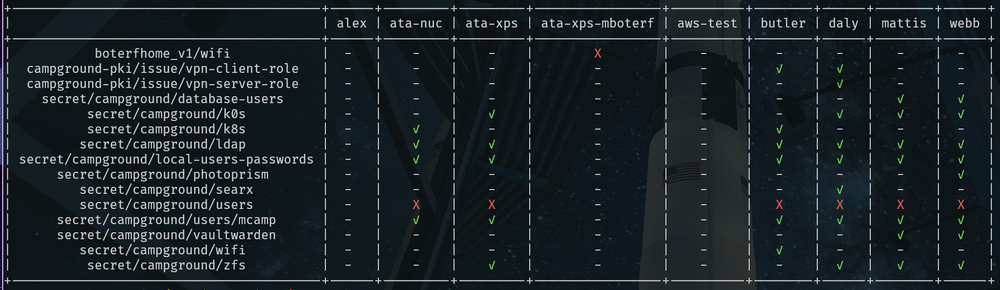

# **Vault Path Checker**

**Overview:**
The Vault Path Checker is a diagnostic tool designed for the Nix Flake ecosystem. If you're working with Vault and encounter long delays or unclear error messages, this tool helps you quickly inspect whether you've configured the correct KV engines. By producing an insightful table output, you can instantly identify any missing `vault-path`.

**Usage:**

```bash
vault login
nix run .#vault-scripts -- <script name>
```

The expected output table format:



## **Mechanism**

1. **Nix Function (`findVaultPaths`)**: This function delves recursively into all modules to identify `vault-path` attributes. When a module is activated, it returns the corresponding `vault-path`.
2. **Shell Scripts**: Composed in Nix, these scripts process the output of the aforementioned Nix function, converting it into a structured JSON format—grouped by system.
3. **Python Script**: This script transforms the JSON data into a visually appealing table for easier inspection.

## **Known Issues & Future Enhancements**

- **Vault-Path Handling**: Currently, the tool returns the `user-secrets` `vault-path` without appending the username. Given Nix's intricacies and the nature of our implementation, rectifying this is a bit challenging.
- **Performance**: The tool's execution time is longer than desired due to the recursive looping over `excalibur` to detect all modules containing `vault-path`. The goal is to automate the process without resorting to manual updates.
- **Feature Request**: In future versions, we aim to introduce an argument to the script, enabling users to input a specific host name. This would tailor the table output for that specific host.
